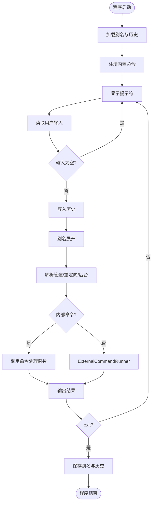
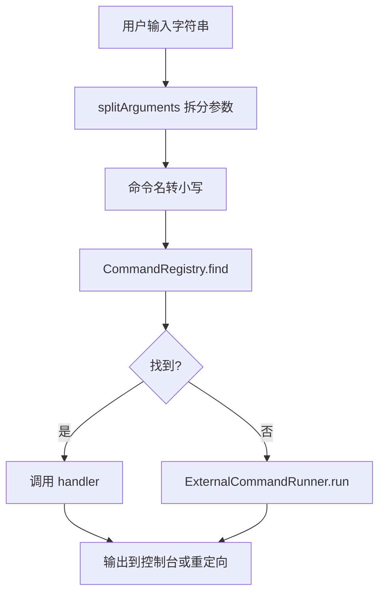
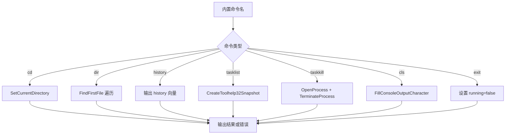
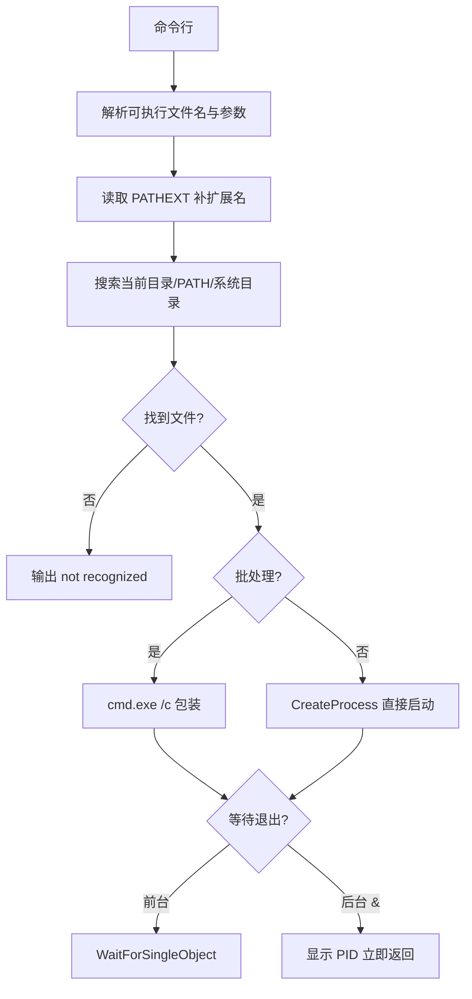
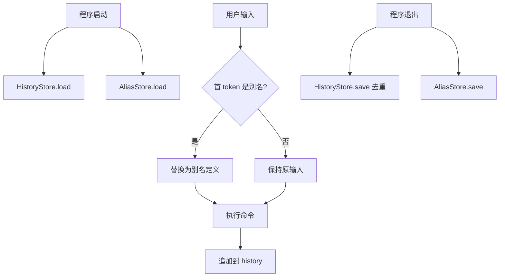
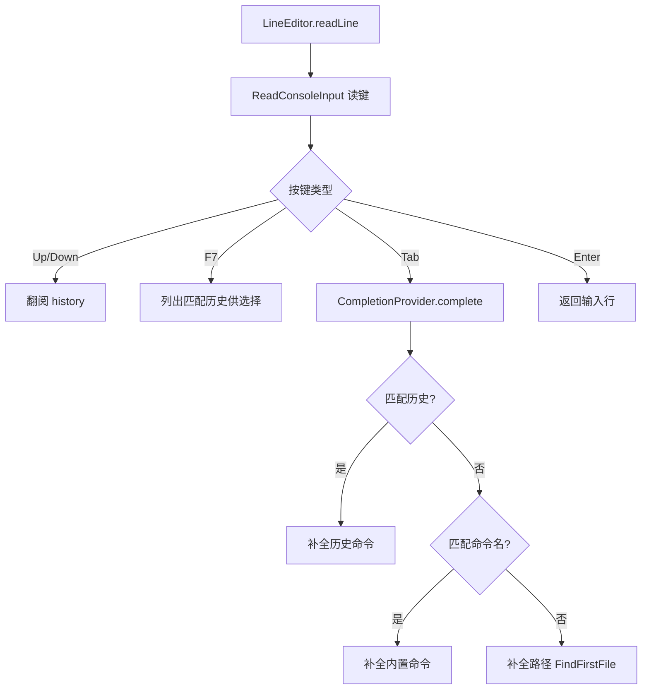

# WinShellX 流程图 Mermaid 代码

导出说明：复制各段代码到 https://mermaid.live ，导出 PNG 后按文件名保存到本目录。

---

## flow_main_loop.png — 主程序总体流程



---

## flow_shell_main.png — 主控与命令调度

```mermaid
flowchart TD
    A[executeInput] --> B[parseShellInput]
    B --> C{含管道 | ?}
    C -->|是| D[执行左命令并捕获输出]
    D --> E[执行右命令并传入管道文本]
    C -->|否| F{后台 & ?}
    F -->|是| G[executeSingle 不等待]
    F -->|否| H[executeSingle 前台执行]
    E --> I[返回]
    G --> I
    H --> I
```

---

## flow_command_dispatch.png — 命令解析与注册



---

## flow_builtin_cmds.png — 内置命令



---

## flow_external_cmd.png — 外部命令执行



---

## flow_pipe_redirect.png — 管道与重定向

```mermaid
flowchart TD
    A[parseShellInput] --> B{含 > ?}
    B -->|是| C[提取输出文件名]
    B -->|否| D{含 | ?}
    C --> D
    D -->|是| E[左命令输出到字符串/管道]
    E --> F[右命令从管道读取]
    D -->|否| G[直接执行单命令]
    F --> H{还有 > ?}
    H -->|是| I[写入文件]
    H -->|否| J[打印到屏幕]
    G --> J
```

---

## flow_history_alias.png — 历史与别名



---

## flow_completion.png — 行编辑与补全


